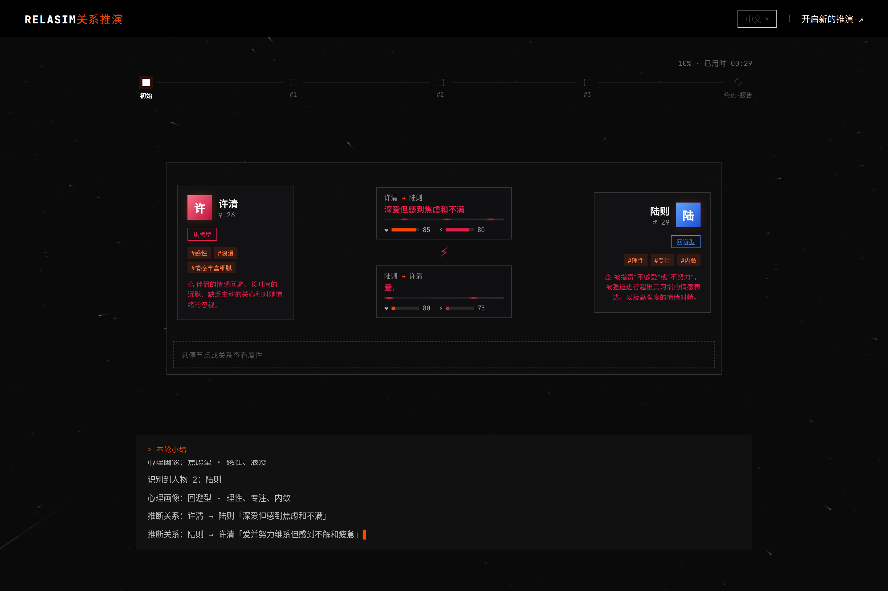
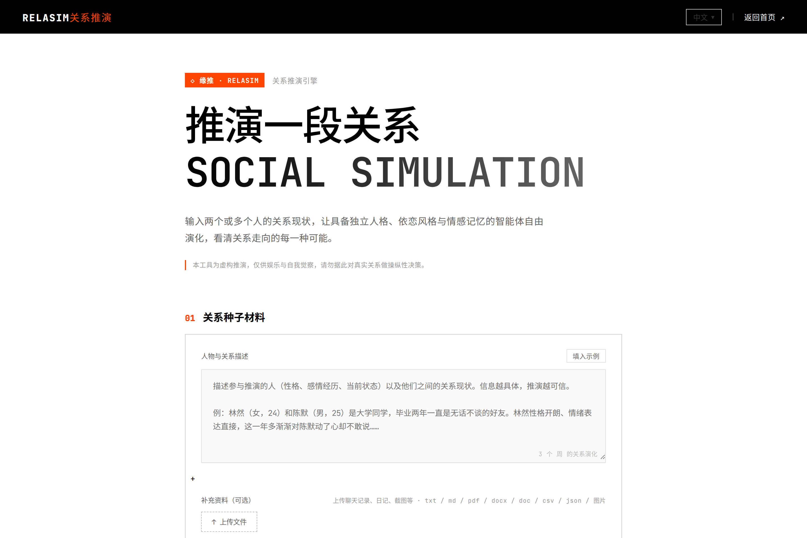
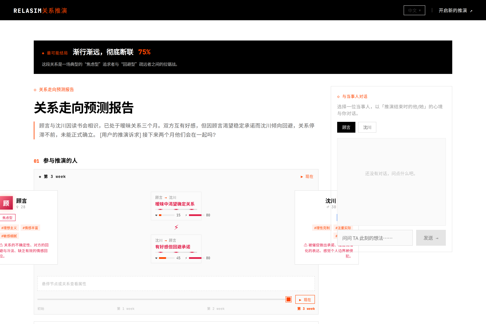

<div align="center">

# RelaSim · 缘推

**人际关系发展推演引擎 —— 把一段关系放进数字沙盘,预演它的未来**

<em>Simulate how a relationship evolves — multi-agent role-play, week by week.</em>



</div>

---

## ⚡ 它做什么

用自然语言描述两个(或多个)真实的人和他们的关系现状,RelaSim 会:

1. **建立关系图谱** —— LLM 从种子材料中识别人物,生成心理画像(性格 / 依恋类型 / 情感需求 / 雷区),并量化双向情感状态(好感 / 信任 / 依赖 / 张力 / 投入,0~100)
2. **逐周仿真演化** —— 多智能体按各自人设在日常互动、约会、深谈、冲突、外部压力等场景中逐轮互动,情感数值随每轮更新;支持"上帝视角"注入事件(如"第 3 周他拿到外地 offer")
3. **生成预测报告** —— 多结局概率分布、关键转折点、心理变化曲线、风险与建议,并附伦理免责声明
4. **与当事人对话** —— 推演结束后可以直接和数字分身聊天,验证 TA 的想法

### 推演过程即体验

推演不是转圈等待,而是一段**暗色时光舱之旅**:星场穿梭背景、人物档案逐个"识别→确认"、双人档案对峙 + 关系能量带实时演变、时间轴滑块可穿梭回看任意时刻的关系状态、终端逐字打出每轮小结,抵达后再展开完整报告。

|  输入种子材料  |  抵达 · 完整报告  |
|:---:|:---:|
|  |  |

## 🖥️ 技术栈

| 层 | 技术 |
|---|---|
| 后端 | Python 3.11+ / Flask,OpenAI 格式 LLM 调用(任意兼容网关),PyMuPDF 文件解析 |
| 前端 | Vue 3 + Vite,vue-router / vue-i18n(中英),Canvas 星场 + SVG 图谱自绘 |
| 存储 | 无数据库,推演结果落盘 JSON(`backend/uploads/relasim/`) |

## 🚀 快速开始

### 1. 配置环境变量

项目根目录建 `.env`:

```env
LLM_API_KEY=sk-xxx                # 必填,OpenAI 格式 API Key
LLM_BASE_URL=https://api.openai.com/v1
LLM_MODEL_NAME=gpt-4o-mini        # 需支持视觉(图片补充资料转录)
# 可选:备用网关(主网关故障时自动切换)
# LLM_FALLBACK_API_KEY= / LLM_FALLBACK_BASE_URL= / LLM_FALLBACK_MODEL_NAME=
```

### 2. 启动后端(:5001)

```bash
cd backend
pip install -r requirements.txt
python run.py
```

### 3. 启动前端(:3000)

```bash
cd frontend
npm install
npm run dev
```

访问 `http://localhost:3000/relasim/`(应用挂在 `/relasim/` 子路径下,便于与其它服务共享域名做路径分流)。

## 📡 API 概览

| 方法 | 路径 | 说明 |
|---|---|---|
| POST | `/api/relasim/run` | 启动推演(seed_material / prediction_query / rounds / time_unit / events / attachments) |
| GET | `/api/relasim/run/status?task_id=` | 轮询进度(含图谱与每轮情感快照,驱动前端实时演变) |
| GET | `/api/relasim/<relasim_id>` | 完整结果(图谱 + 逐轮仿真 + 报告) |
| POST | `/api/relasim/upload` | 上传补充资料,解析为文本(txt / md / pdf / docx / doc / csv / json / log / 常见图片 — 图片走视觉 LLM 转录聊天截图) |
| POST | `/api/relasim/chat` | 与推演中的人物对话 |
| GET | `/api/relasim/history` | 历史推演列表 |

## ⚠️ 免责声明

本项目基于用户提供的信息进行**虚构推演**,仅供娱乐与自我觉察参考,不代表真实的人的真实想法。请勿据此对现实关系做操纵性决策;上传的聊天记录等内容会发送给 LLM 处理,请注意隐私。

## 📄 License

AGPL-3.0
